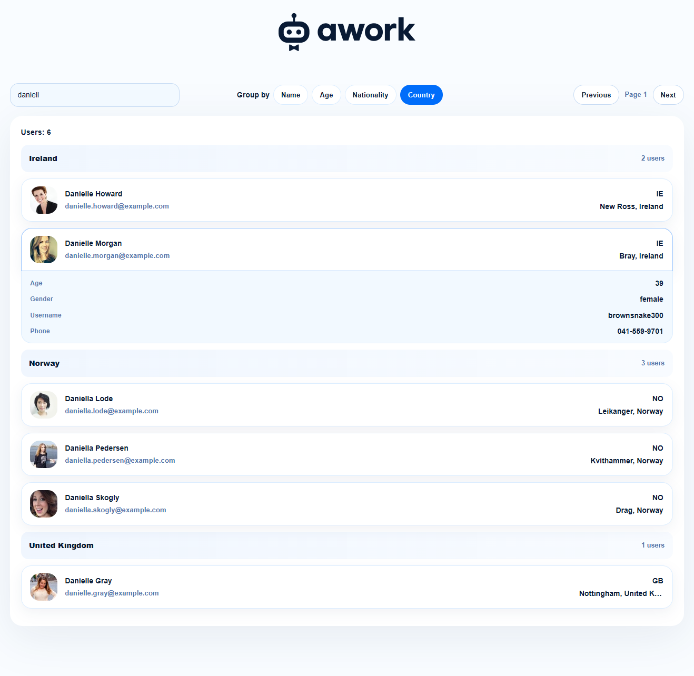
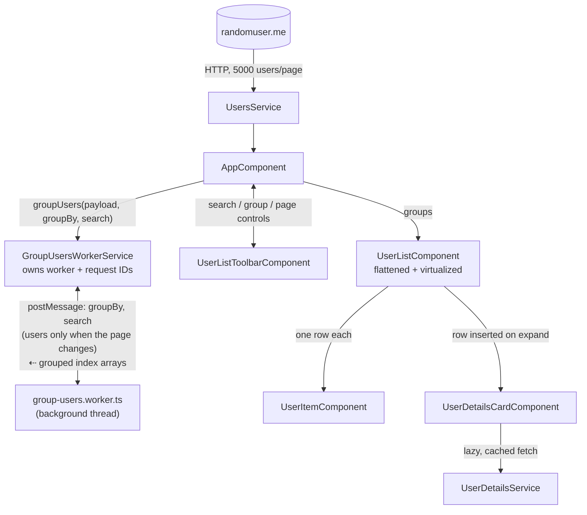

# Awork Users Dashboard

A **signals-first Angular 20 app** that loads and virtualizes a large, filterable, searchable list of ~5,000 users from randomuser.me. Features off-thread grouping via Web Worker, real-time search, pagination, and lazy-loaded expandable user details.

[https://awork-users-dashboard.netlify.ap](https://awork-users-dashboard.netlify.app)



## Core Features

- ✅ **Load 5,000 users** deterministically from randomuser.me API
- ✅ **Off-thread grouping & filtering** — Web Worker groups and filters users without blocking the main thread
- ✅ **Virtualized list** — efficient rendering of thousands of rows with minimal DOM nodes
- ✅ **Search & filter** — debounced search (3+ chars, 220ms debounce) across user data
- ✅ **Group by** — name, age, nationality, or country with locale-aware sorting
- ✅ **Pagination** — navigate between pages without refetching
- ✅ **Expandable details** — lazy-loaded, cached per-user details with smooth expand/collapse
- ✅ **Responsive design** — optimized for desktop and mobile viewing

## Architecture Overview



**Component breakdown:**
- **`AppComponent`** — state container holding users, groups, search, grouping strategy and pagination as signals
- **`UserListToolbarComponent`** — search/group/pagination controls (presentational; search is a two-way `model()`)
- **`UsersService`** — fetches 5,000 users/page and maps API shape to `User` model
- **`GroupUsersWorkerService`** — owns the worker's lifecycle, tags each request with an ID and drops superseded responses, exposing a plain `Observable`
- **`group-users.worker.ts`** — filters, groups, and sorts off main thread; returns index arrays
- **`UserListComponent`** — flattens groups into one virtualized list
- **`UserItemComponent`** — stateless collapsed row; the whole card is clickable and emits `toggle`
- **`UserDetailsCardComponent`** + **`UserDetailsService`** — lazy-loaded, cached user details

## Why This Architecture

| Decision | Benefit |
|----------|---------|
| **Web Worker + Index Arrays** | Grouping 5,000 objects off-thread is fast; posting indices (not cloned users) avoids expensive serialization and keeps messages small |
| **Worker Caches the User Array** | Users cross the thread boundary once per page, not once per keystroke; re-grouping and re-searching send only `{ groupBy, search }` |
| **Slim Worker Payload** | The worker receives the five fields it actually reads, not whole `User` objects — no email, phone, image or login hashes cloned and retained off-thread |
| **Fully Flattened List** | Groups don't nest in separate containers; one list virtualizes against the real scrollbar (not per-group boxes) for accurate scroll positioning |
| **Expand Inserts a Row** | Expanding inserts a sibling details row instead of resizing; virtualization knows the array length changed; CSS height changes would confuse sizing |
| **List Stays Mounted While Re-grouping** | Re-grouping dims the list in place instead of swapping it for a spinner; unmounting would discard the virtualizer's measured row sizes and reset the window scroll on every search |
| **Signals + OnPush Change Detection** | Every component uses `ChangeDetectionStrategy.OnPush` with signals; RxJS handles async boundaries only (HTTP, debounce, fetch), keeping signal graph simple |
| **Lazy Details with RxJS Cache** | Simulates genuine lazy loading; `shareReplay` caches results (bounded at 200) to avoid growing memory in long sessions |

## Key Design Patterns

### 1. Virtual Scrolling with Accurate Row Sizing
- **Pattern**: `@tanstack/angular-virtual` with `estimateSize()` + `ResizeObserver` measurement
- **Why TanStack over CDK**: CDK's fixed-size strategy requires uniform heights (won't work for mixed headers/users/details); TanStack's per-row measurement cache avoids averaging bugs that shift scroll position
- **Performance gain**: Only ~15 DOM nodes rendered regardless of 5,000-user list length; no layout thrashing on expand/collapse

### 2. Off-Thread Filtering & Grouping
- **Pattern**: Web Worker processes `filterUserIndexes()` and `groupUserIndexes()` logic; returns index arrays mapped back to users on main thread
- **Why index arrays**: Serializing 5,000 objects across the worker boundary is expensive; indices keep the response tiny and avoid object cloning
- **Both directions matter**: the request side is cached too — the worker keeps the last user array it received, so only `{ groupBy, search }` crosses on a re-group or re-search. Users are resent only when the page changes
- **Slim payload**: `UserPayload` is an explicit five-field interface (`firstname`, `lastname`, `age`, `nat`, `country`), not `Partial<User>` — the worker never receives the email, phone, image or login hashes it has no use for

### 3. Flat Row Array with Splice-In Details
- **Pattern**: `baseRows` computed (headers + users) + a `rows` computed that splices in `details` rows for expanded users
- **Why splice**: Virtualization sees array length change; CSS-hidden rows confuse height estimation
- **Why two computeds**: `baseRows` depends only on `groups`, so expanding or collapsing never rebuilds it — and with nothing expanded, `rows` returns `baseRows` untouched

### 4. Debounced Input + Request IDs
- **Pattern**: the `search` signal is bridged to RxJS with `toObservable()` + `debounceTime(220)`; each worker/API call tagged with request ID; stale responses ignored
- **Why request IDs**: Rapid interactions (filter → clear → filter) can race; old results clobber new ones without tracking
- **Why 3-char minimum**: below the threshold the search is treated as empty, so short prefixes that match nearly everything never reach the worker

### 5. Lazy-Loaded Details with Bounded Cache
- **Pattern**: `UserDetailsService` pipes each result through `shareReplay({ bufferSize: 1, refCount: false })` and stores the observable in a `Map` capped at 200 entries with FIFO eviction
- **Why lazy**: Details aren't needed until expand; avoids building view models for 5,000 users upfront
- **Why `refCount: false`**: the cached result survives all subscribers unsubscribing, so collapsing and re-expanding a row is instant rather than re-running the simulated fetch
- **Users without a stable id are not cached** — sharing one placeholder key would hand every such user the first one's details

### 6. Locale-Aware Sorting with a Shared Collator
- **Pattern**: one module-level `Intl.Collator(undefined, { numeric: true, sensitivity: 'base' })` is reused for every comparison, in every grouping operation
- **Why reuse**: constructing a collator is comparatively expensive, and doing it per comparison would repeat identical configuration thousands of times per sort
- **Why `sensitivity: 'base'`**: case and accent differences don't reorder names, so grouping stays stable across locales

## Setup and Running

Requires **Node.js 20+** and **npm**.

```bash
npm install
npm run build
npm run start              # Dev server at http://localhost:4200/
```

### Testing

```bash
npm test                                                           # Jest unit tests, full suite
npm run test:watch                                                 # Jest in watch mode
npm run e2e                                                        # Playwright e2e, headed (real browser)
npm run e2e:headless                                               # Playwright e2e, headless (CI)
npx jest src/app/components/user-list/user-list.component.spec.ts # Single spec file
```

## Libraries

### Runtime

[](https://github.com/angular/angular)
[](https://github.com/tanstack/virtual)
[](https://github.com/ReactiveX/rxjs)
[](https://github.com/angular/zone.js)
[](https://github.com/Microsoft/tslib)

### Development & Testing

[](https://github.com/angular/angular-cli)
[](https://github.com/microsoft/TypeScript)
[](https://github.com/jestjs/jest)
[](https://github.com/microsoft/playwright)
[](https://github.com/kulshekhar/ts-jest)

