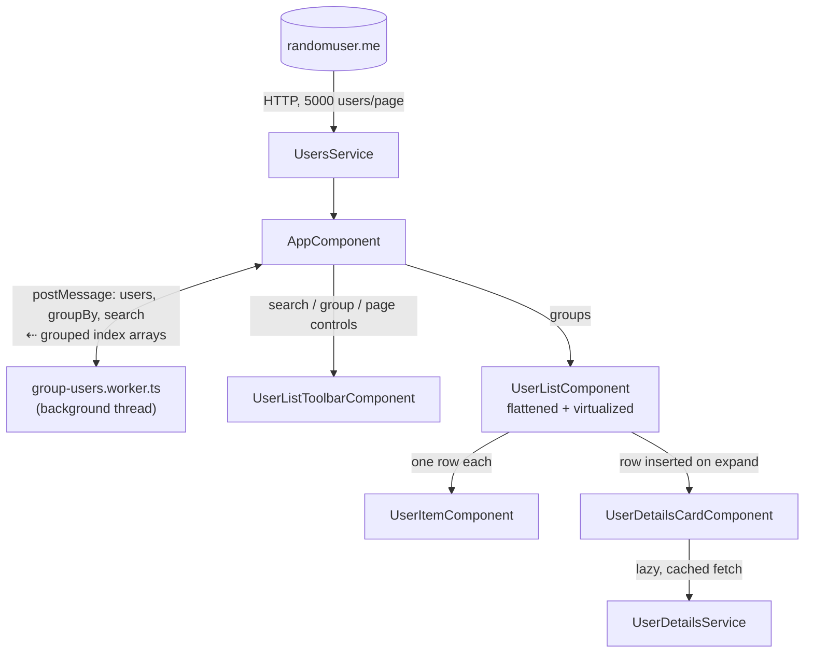

# Awork user explorer

An Angular app that loads deterministic pages of 5,000 users from randomuser.me, groups and filters them off the main thread in a Web Worker, and renders the result as one virtualized, expandable list — grouping by name, age, nationality, or country, with local search, pagination, and lazy-loaded per-user details.

## Setup and running

Requires Node.js (Angular 20 / Node 20+) and npm.

```bash
npm install
npm start
```

Open `http://localhost:4200/`

### Build

```bash
npm run build
```

### Unit tests

```bash
npm test              # full suite, once
npm run test:watch    # watch mode
npx jest src/app/components/user-list/user-list.component.spec.ts   # a single spec
```

### End-to-end tests

```bash
npm run e2e              # headed
npm run e2e:headless     # headless (CI)
```

`e2e/app.spec.ts` drives `AppComponent`'s main flows in a real browser — load, grouping, search, expand/collapse with lazy-loaded details, pagination, the error state — against `playwright.config.ts`'s auto-started dev server. Each test intercepts `randomuser.me` and serves the repo's own `MockResult` fixture (`src/app/mock-data.ts`, already used by `UsersServiceStub`) instead of the real API, so the suite is fast and deterministic.

## Architecture



- **`AppComponent`** — page state: grouping, search text, loading/error state, pagination, worker lifecycle.
- **`UserListToolbarComponent`** — presentational; search/group/pagination controls via inputs/outputs only.
- **`UsersService`** — fetches 5,000 users/page, maps the raw API shape to `User`.
- **`group-users.worker.ts`** — filters, groups, and sorts off the main thread; posts back index arrays instead of cloning 5,000 objects across the boundary.
- **`UserListComponent`** — flattens `groups` into one virtualized list.
- **`UserItemComponent`** — presentational, stateless collapsed row.
- **`UserDetailsCardComponent`** + **`UserDetailsService`** — render and lazily fetch a user's extended fields once their row expands.

## Libraries

**Runtime**

| Library | Version |
|---|---|
| Angular (`core`, `common`, `forms`, `router`, `animations`, `platform-browser`) | 20.3.27 |
| `@tanstack/angular-virtual` | ^6.0.2 |
| `rxjs` | 7.8.0 |
| `zone.js` | 0.15.1 |

**Development & testing**

| Library | Version |
|---|---|
| `@angular/cli` / `@angular-devkit/build-angular` | ^20.3.33 |
| `typescript` | 5.9.2 |
| `jest` (+ `jest-preset-angular`, `jest-environment-jsdom`) | ^30.4.2 |
| `@playwright/test` | ^1.62.1 |

## Key decisions

### Virtualizing a list with expandable rows

The list can hold thousands of rows (~5,000 users + group headers), so virtualization is necessary — but it fights a naive "expand in place" interaction unless you're careful how.

**Fully flattened, not grouped-then-nested.** `UserListComponent` turns `groups: UserGroup[]` into one flat `header | user | details` array and virtualizes *that* against the real window scrollbar, not a boxed scroll region per group. Nested "cards containing mini-scrollboxes" reads as fragmented, and forces every group to virtualize independently regardless of size.

**Expanding inserts a row, never resizes one.** An earlier version animated a row's own height open/closed via CSS — that fights virtualization, since whatever's deciding "what's visible and where" needs to already know each row's size, and a value changing mid-transition desyncs from what it believes. The fix was architectural: expanding a user inserts a sibling `DetailsRow` right after it (removed on collapse). A row's size never changes once mounted; only the array's length does, which virtualization handles well.

**`@tanstack/angular-virtual`, not Angular CDK.** A few iterations landed here:
1. CDK's stable `FixedSizeVirtualScrollStrategy` only supports one uniform row size — doesn't fit header/user/details rows of different heights.
2. `@angular/cdk-experimental`'s `autosize` supports variable sizes via a *running average* — blending very different row heights into one average produced a real, reproducible bug: the scrollable area grew/shrank inconsistently when expanding a row near the end of a long list. (CDK's own docs call this strategy "not ready for production use yet.")
3. A hand-written custom `VirtualScrollStrategy` (prefix-sum offsets, declared-not-measured sizes) fixed it by construction, but was real CDK-internals-shaped code for a problem a maintained library already solves.
4. TanStack's `estimateSize`/`measureElement` model supports per-row sizes natively — each row's *measured* size is cached against its own stable key, never blended into a shared average. Net effect: less code than the hand-rolled strategy, and `@angular/cdk`/`@angular/cdk-experimental` are gone as dependencies entirely.

**Declared size seeds the layout; real measurement corrects it.** `estimateSize` gives each row kind a best-effort hand-computed height (so first paint doesn't jump), and `measureElement` (`ResizeObserver`, wired via `#virtualItem` refs) self-corrects to what a row actually renders at. Getting those hand-computed numbers exactly right was genuinely hard (see [Challenges](#challenges)) — the self-correction means a future CSS tweak that drifts the estimate costs one corrected layout pass, not a silent clip or gap.

### Lazy-loaded, cached user details

`randomuser.me` has no per-user detail endpoint — every field `UserDetailsCardComponent` shows already arrives on the initial list fetch. `UserDetailsService` still models a genuine lazy load: it defers building the detail view until a row is actually expanded and simulates realistic latency, so the loading/caching/subscription plumbing behaves as it would against a real endpoint. Results are cached per user id (RxJS `shareReplay`, kept warm after unsubscribe), bounded at 200 entries (FIFO eviction) so a long session doesn't grow it unboundedly.

`UserDetailsCardComponent` consumes this via `rxResource` rather than a hand-rolled `effect()` + manual signals + subscription cleanup. Worth flagging: `rxResource` is `@experimental` in this Angular version — a different risk profile than CDK's `autosize` (Angular-core-owned and already recommended in Angular's own docs for this pattern, vs. a specific strategy with a known bug), but still not a stable API.

### Signals-first, OnPush everywhere

Every component is `OnPush`; row flattening, expand state, and the virtualizer's options are all signals/`computed()`. `UserListComponent.rows` splits into `baseRows` (headers + users, depends only on `groups`) and `rows` (splices in details rows for whoever's expanded) — the common "nothing expanded" state, and collapsing back to it, doesn't re-walk the whole list, only an actual expand/collapse does.

RxJS is still used at the true async boundaries — `HttpClient`, the debounced search input, the simulated detail fetch — not for general app state.

## Performance decisions

- Grouping/filtering/sorting run in a Web Worker; it returns index arrays, not 5,000 cloned `User` objects.
- Search is debounced (220ms) and only filters at 3+ characters.
- The whole list — not per group — is virtualized against the real window scrollbar: a fixed, small DOM node count regardless of list length.
- `estimateSize` returns each row's real size, and TanStack's own `setRenderedRange`/`setRenderedContentOffset` already no-op on unchanged values, so a tiny scroll delta costs nothing extra.
- The `baseRows`/`rows` split avoids rebuilding the full row array on every expand/collapse.
- Avatars use `loading="lazy"` (skip offscreen fetches) and `decoding="async"` (don't block a paint frame decoding one that loads).
- Worker sorting reuses one `Intl.Collator` per grouping operation instead of reconfiguring locale comparison per pair.
- Request IDs discard stale worker/API results so rapid interactions can't let an old response clobber a newer one.

## Testing and a known gap

Two tiers: unit/component tests (Jest + jsdom) and Playwright e2e tests (`e2e/app.spec.ts`) covering the same main flows against a real rendered page. The reason both exist: jsdom has no real layout engine, so several of this app's actual bugs (a CSS animation clipping against `overflow: hidden`, a details card's height computed from a wrong assumed line-height) were only ever findable by looking at the running app — exactly what the e2e tier is for. Its own verification gap in this particular sandbox is described in [End-to-end tests](#end-to-end-tests) above.

## Challenges

**Getting virtual scrolling correct for a heterogeneous, dynamically-changing list, with no way to see it render.** The list mixes three row heights, rows insert/remove on every expand/collapse, and the one real bug found in this effort (CDK `autosize`'s averaging producing an inconsistently-sized scroll area) only showed up scrolled deep into a long list with something expanded near the boundary — not obvious from reading the code. Diagnosing and fixing it happened through reading CDK's and TanStack's actual source, not just their docs, plus real-browser reports as the only ground-truth feedback loop, since this environment can't run a browser itself.

**Computing exact pixel heights from a non-obvious CSS cascade, by hand.** The details card's height (padding + 4 text rows + gaps) went through three values before landing correctly — first assuming a 16px root font-size (it's 14px), then assuming the reset's `line-height: 1` was in effect (a later file in the same stylesheet's own import chain redeclares `line-height: 20px`, same specificity, later in the cascade, so it wins). Both mistakes were internally consistent, just built on a wrong premise — easy to make confidently, hard to catch without a real render to check against. Real DOM measurement (above) is what makes this class of bug non-fatal even when it recurs.
